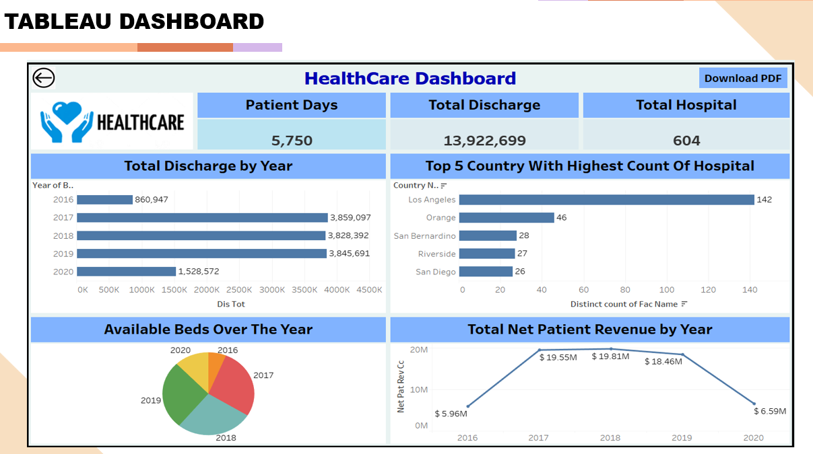
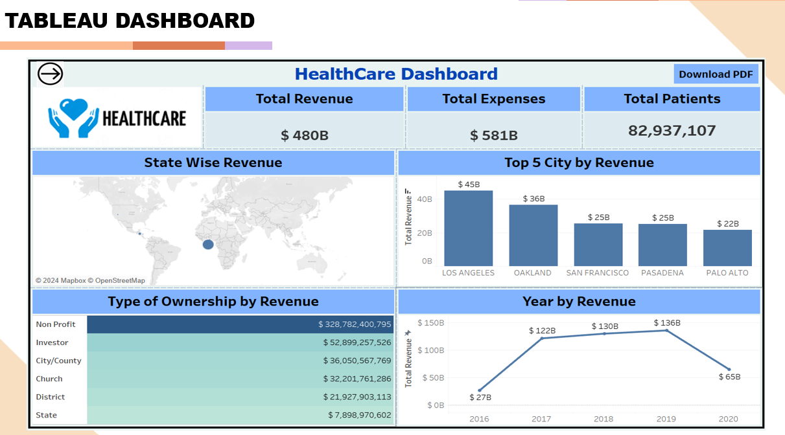
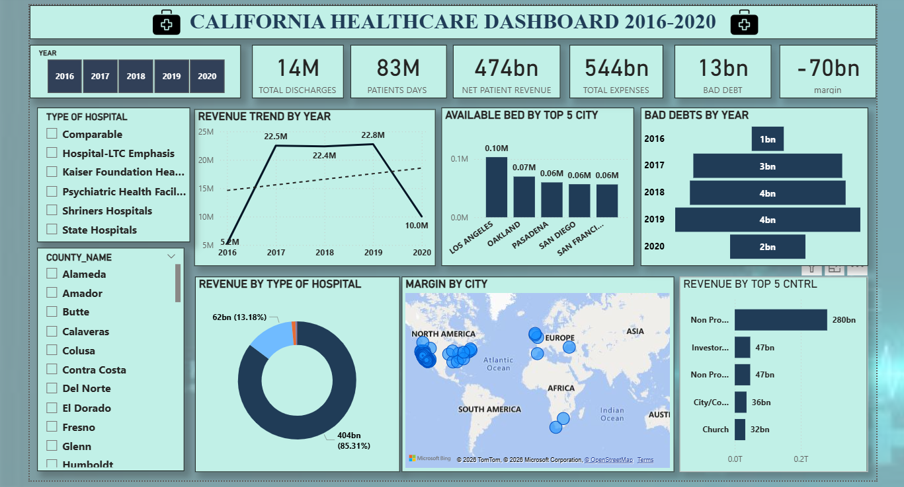

# 🏥 Healthcare Data Analysis Project

## 📊 Overview
This project focuses on analyzing healthcare data from California hospitals to identify trends, financial insights, and operational performance. The analysis highlights the impact of external factors such as the COVID-19 pandemic on healthcare systems.

---

## 📁 Project Structure
california-healthcare-data-analysis-excel-powerbi/
│── Healthcare_Project.pptx
│── Hospital_Dataset.xlsx
│── Power-Bi.png
│── Tableau.png
│── Tableau_2.png
│── README.md

---

## 🎯 Objectives
- Analyze hospital performance and patient data
- Identify trends in revenue, expenses, and patient care
- Understand the impact of pandemic disruptions
- Visualize healthcare insights using dashboards

---

## 🛠️ Tools Used
- Microsoft Excel (Data Analysis & Line Charts)
- Power BI (Dashboard & Visualization)
- Tableau (Pie Charts & Insights)

---

## 📈 Key KPIs Covered
- Total Patients  
- Total Hospitals  
- Total Patient Stays  
- Total Discharges  
- Net Patient Revenue  
- Total Expenses  
- Bad Debt Analysis  
- Revenue by City  
- Margin by City  
- Available Beds by City  
- Revenue Trends (Year-wise)  

---

## 📊 Key Insights

### 📉 Trend Analysis (2016–2020)
- Bad debts and charity care increased from 2016 to 2019  
- Significant decline observed in 2020 due to COVID-19 impact  

### 📊 Yearly Distribution
- Peak observed in 2017  
- Gradual decline till 2020  
- Sharp drop in 2020 due to global disruption  

### 🏙️ City-wise Bed Availability
- Los Angeles: 103K beds (highest)  
- Oakland: 70K  
- Pasadena: 60K  
- San Diego: 57K  
- San Francisco: 56K  

### ⚠️ Pandemic Impact
- Major decline in revenue and operations in 2020  
- Strong indication of COVID-19 impact on healthcare system  

---

## 📌 Conclusion
The analysis clearly shows the impact of the COVID-19 pandemic on healthcare operations and financial performance. It also highlights the importance of proper resource allocation across cities to handle healthcare demands effectively.

---

## 📷 Dashboard Preview
### 📊 Tableau Dashboard 1

### 📊 Tableau Dashboard 2

### 📊 Power BI Dashboard

---

## 🚀 Future Improvements
- Add real-time data integration  
- Perform predictive analysis  
- Use Python for advanced analytics  

---

## 👨‍💻 Author
**Nikhil Jangir**  
EDI Analyst | Aspiring Data Analyst  
📧 Email: nikhiljangir1811@gmail.com
🔗 LinkedIn: https://www.linkedin.com/in/nikhil-jangir-6485bb311  
💻 GitHub: https://github.com/Nikhil162002 
